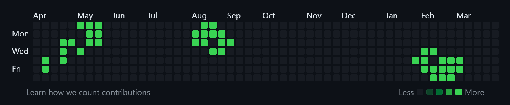

# Snake of Life 🐍 🟩

⚠️ Work in Progress

Hybrid of Conway’s Game of Life and classic Snake

<details>
<summary><strong>Prerequisites</strong></summary>

* **Python** 3.8 or higher

</details>

<details>
<summary><strong>Instalation</strong></summary>

1. Clone the repository:
   ```
   git clone https://github.com/yourusername/SnakeOfLife.git
   cd SnakeOfLife
   ```
2. Install dependencies:
    ```
    pip install -r requirements.txt
    ```

</details>

<details>
<summary><strong>Usage</strong></summary>

Run the game with:

```bash
python main.py [-l LEVEL]
```

* `-l, --level` (optional) – choose a level:

  * `sol-demo` (default) – Snake of Life demo
  * `gol-demo` – Conway's Game of Life on a randomized board

### Keybindings 
* W/A/S/D: steer the snake  
* F1–F5: show/hide the stats overlay 


</details>
